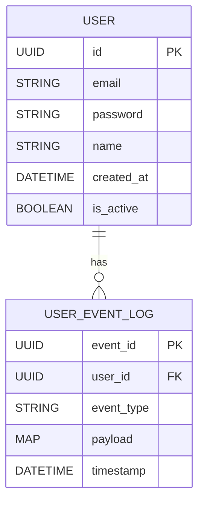

# {{Project Name}} - Data Modeling

**Replace for the actual instructions**

This template helps organize data models by **domain** to support multiple databases or storage systems. It includes schema, storage, interface, and infrastructure details.

## 🔍 Overview

Visual overview of domains, models, and their relationships.



## 🏷️ Domain: `{{Model Domain}}`

**Replace for the actual instructions**

Manages user accounts, authentication, and profile data.

### 📘 Model: `{{Model Name}}`

#### 📌 Purpose

Represents a registered user with credentials and metadata.

#### 🧬 Schema

| Field        | Type     | Constraints        | Description                   |
| ------------ | -------- | ------------------ | ----------------------------- |
| `id`         | UUID     | PK, auto-generated | Unique user ID                |
| `email`      | string   | required, unique   | User login email              |
| `password`   | string   | hashed             | Hashed user password          |
| `name`       | string   | optional           | Full name                     |
| `created_at` | datetime | auto-generated     | Record creation timestamp     |
| `is_active`  | boolean  | default: true      | Whether the account is active |

#### 📥 Sample JSON

```json
{
  "id": "3e9b5e42-a151-4376-bc59-ef1f66f95d68",
  "email": "jane@example.com",
  "password": "$2b$10$abc...",
  "name": "Jane Doe",
  "created_at": "2025-06-15T12:00:00Z",
  "is_active": true
}
```

#### 🗃️ Storage

- **Database**: PostgreSQL
- **Table**: `users`
- **Primary Key**: `id`
- **Indexes**: `email (unique)`, `created_at`
- **Infra**: `RDS Postgres - AWS eu-west-1`

#### 🔌 Interface: `UserRepository`

| Method                | Params       | Returns | Description        |                     |
| --------------------- | ------------ | ------- | ------------------ | ------------------- |
| `get_by_id(id)`       | `UUID`       | \`User  | None\`             | Fetch user by ID    |
| `get_by_email(email)` | `string`     | \`User  | None\`             | Fetch user by email |
| `create(data)`        | `dict`       | `User`  | Create a new user  |                     |
| `update(id, data)`    | `UUID, dict` | `User`  | Update user fields |                     |
| `delete(id)`          | `UUID`       | `bool`  | Delete user        |                     |

---

## 🏷️ Domain: `Event Logs`

Stores immutable audit logs and activity tracking for users.

---

### 📘 Model: `UserEventLog`

#### 📌 Purpose

Represents an immutable log of user actions (e.g., login, password change).

#### 🧬 Schema

| Field        | Type     | Constraints    | Description                   |
| ------------ | -------- | -------------- | ----------------------------- |
| `event_id`   | UUID     | PK             | Unique event ID               |
| `user_id`    | UUID     | required       | Foreign key to `User`         |
| `event_type` | string   | required       | Type of event                 |
| `payload`    | map      | optional       | Metadata related to the event |
| `timestamp`  | datetime | auto-generated | When the event occurred       |

#### 📥 Sample JSON

```json
{
  "event_id": "7ffafeb5-4934-4f0a-9b15-9f0a066e9847",
  "user_id": "3e9b5e42-a151-4376-bc59-ef1f66f95d68",
  "event_type": "LOGIN_SUCCESS",
  "payload": {
    "ip": "192.168.1.100",
    "user_agent": "Mozilla/5.0"
  },
  "timestamp": "2025-06-15T13:22:01Z"
}
```

#### 🗃️ Storage

- **Database**: DynamoDB
- **Table**: `user_event_logs`
- **Partition Key**: `user_id`
- **Sort Key**: `timestamp`
- **Infra**: `DynamoDB - AWS eu-west-1`

#### 🔌 Interface: `UserEventLogStore`

| Method                 | Params   | Returns          | Description               |
| ---------------------- | -------- | ---------------- | ------------------------- |
| `put(event)`           | `dict`   | `bool`           | Persist a new event       |
| `get_by_user(user_id)` | `UUID`   | `List[EventLog]` | Retrieve all logs by user |
| `get_by_type(type)`    | `string` | `List[EventLog]` | Filter logs by event type |

---

## 📚 Tips

**Remove this section before using the template**

- Group models by **domain** not by storage.
- Always describe **where** data is stored and **how** it’s accessed.
- Sample nested JSON is essential when modeling maps, sets, or relations.
- Explicitly mention **cloud region and service** used for deployment (RDS, DynamoDB, etc.).
